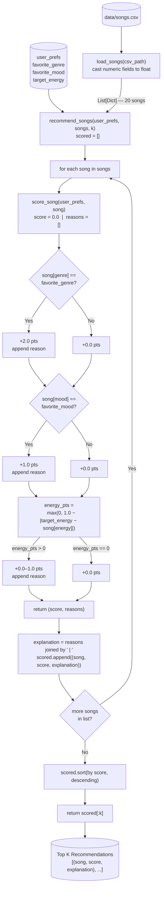

# 🎵 Music Recommender Simulation

## Project Summary

In this project you will build and explain a small music recommender system.

Your goal is to:

- Represent songs and a user "taste profile" as data
- Design a scoring rule that turns that data into recommendations
- Evaluate what your system gets right and wrong
- Reflect on how this mirrors real world AI recommenders

Replace this paragraph with your own summary of what your version does.

---

## How The System Works

Real-world recommenders like Spotify and YouTube blend two approaches: collaborative filtering, which finds patterns across millions of users ("people like you also listened to..."), and content-based filtering, which scores songs based on their own attributes like energy, mood, and tempo. This version focuses on content-based filtering. A user profile is compared against every song in the catalog — each song earns points for how well it matches — and the top scorers are returned as recommendations.

### Data Flow



### Scoring Recipe (max 4.0 points)

| Component | Points | Rule |
|---|---|---|
| Genre match | +2.0 | Exact string match on `genre` |
| Mood match | +1.0 | Exact string match on `mood` |
| Energy similarity | +0.0 – 1.0 | `1.0 − \|target_energy − song_energy\|` |

Genre is weighted highest because it constrains the broadest sonic palette — instruments, structure, and tempo range. A mood like "chill" spans multiple genres (lo-fi, ambient, jazz), so it is a weaker signal on its own. Energy uses a linear proximity formula rather than a binary match: a song with energy exactly equal to `target_energy` earns the full 1.0 point, a difference of 0.5 earns 0.5 points, and a difference of 1.0 or more earns nothing. Every song receives some energy score, which acts as a natural tie-breaker between songs that share genre and mood. Fields not present in the user profile — `valence`, `danceability`, `tempo_bpm`, `acousticness` — do not contribute to the score.

### Sample Output

Run with `python -m src.main` from the project root (profile: genre=pop, mood=happy, energy=0.8):

```
Loading songs from data/songs.csv...
Loaded songs: 20

==================================================
  Top Recommendations
==================================================

#1  Sunrise City by Neon Echo
    Score : 3.98 / 4.00
    Why   : Genre match: pop (+2.0) | Mood match: happy (+1.0) | Energy similarity: 0.98 (+0.98)

#2  Gym Hero by Max Pulse
    Score : 2.87 / 4.00
    Why   : Genre match: pop (+2.0) | Energy similarity: 0.87 (+0.87)

#3  Rooftop Lights by Indigo Parade
    Score : 1.96 / 4.00
    Why   : Mood match: happy (+1.0) | Energy similarity: 0.96 (+0.96)

#4  Concrete Jungle by Hex Theory
    Score : 0.98 / 4.00
    Why   : Energy similarity: 0.98 (+0.98)

#5  Night Drive Loop by Neon Echo
    Score : 0.95 / 4.00
    Why   : Energy similarity: 0.95 (+0.95)
```

### Potential Biases

- **Genre lock-in.** At 2.0 points, genre dominates. A near-perfect mood and energy match in a different genre (score ≤ 2.0) will always rank below a genre match with no other overlap (score = 2.0). Users with niche or cross-genre taste will see worse results.
- **Catalog under-representation.** The 20-song catalog covers some genres with a single track (e.g. metal, blues, country, reggae). A user whose favorite genre has only one representative will always get that same song at the top regardless of mood or energy fit.
- **Exact-match brittleness.** Genre and mood are scored as binary matches. A user who prefers "indie pop" gets zero genre points for "pop" songs and zero mood points if their mood is listed as "happy" but the song is tagged "energetic" — even if the songs sound nearly identical to a human listener.
- **No personalization over time.** The profile is static. The system cannot learn that a user who asks for "chill" lo-fi at 9 PM wants something different at noon. Every session starts from the same fixed weights.

---

## Getting Started

### Setup

1. Create a virtual environment (optional but recommended):

   ```bash
   python -m venv .venv
   source .venv/bin/activate      # Mac or Linux
   .venv\Scripts\activate         # Windows

2. Install dependencies

```bash
pip install -r requirements.txt
```

3. Run the app:

```bash
python -m src.main
```

### Running Tests

Run the starter tests with:

```bash
pytest
```

You can add more tests in `tests/test_recommender.py`.

---

## Experiments You Tried

Use this section to document the experiments you ran. For example:

- What happened when you changed the weight on genre from 2.0 to 0.5
- What happened when you added tempo or valence to the score
- How did your system behave for different types of users

---

## Limitations and Risks

Summarize some limitations of your recommender.

Examples:

- It only works on a tiny catalog
- It does not understand lyrics or language
- It might over favor one genre or mood

You will go deeper on this in your model card.

---

## Reflection

Read and complete `model_card.md`:

[**Model Card**](model_card.md)

Write 1 to 2 paragraphs here about what you learned:

- about how recommenders turn data into predictions
- about where bias or unfairness could show up in systems like this


---

## 7. `model_card_template.md`

Combines reflection and model card framing from the Module 3 guidance. :contentReference[oaicite:2]{index=2}  

```markdown
# 🎧 Model Card - Music Recommender Simulation

## 1. Model Name

Give your recommender a name, for example:

> VibeFinder 1.0

---

## 2. Intended Use

- What is this system trying to do
- Who is it for

Example:

> This model suggests 3 to 5 songs from a small catalog based on a user's preferred genre, mood, and energy level. It is for classroom exploration only, not for real users.

---

## 3. How It Works (Short Explanation)

Describe your scoring logic in plain language.

- What features of each song does it consider
- What information about the user does it use
- How does it turn those into a number

Try to avoid code in this section, treat it like an explanation to a non programmer.

---

## 4. Data

Describe your dataset.

- How many songs are in `data/songs.csv`
- Did you add or remove any songs
- What kinds of genres or moods are represented
- Whose taste does this data mostly reflect

---

## 5. Strengths

Where does your recommender work well

You can think about:
- Situations where the top results "felt right"
- Particular user profiles it served well
- Simplicity or transparency benefits

---

## 6. Limitations and Bias

Where does your recommender struggle

Some prompts:
- Does it ignore some genres or moods
- Does it treat all users as if they have the same taste shape
- Is it biased toward high energy or one genre by default
- How could this be unfair if used in a real product

---

## 7. Evaluation

How did you check your system

Examples:
- You tried multiple user profiles and wrote down whether the results matched your expectations
- You compared your simulation to what a real app like Spotify or YouTube tends to recommend
- You wrote tests for your scoring logic

You do not need a numeric metric, but if you used one, explain what it measures.

---

## 8. Future Work

If you had more time, how would you improve this recommender

Examples:

- Add support for multiple users and "group vibe" recommendations
- Balance diversity of songs instead of always picking the closest match
- Use more features, like tempo ranges or lyric themes

---

## 9. Personal Reflection

A few sentences about what you learned:

- What surprised you about how your system behaved
- How did building this change how you think about real music recommenders
- Where do you think human judgment still matters, even if the model seems "smart"

